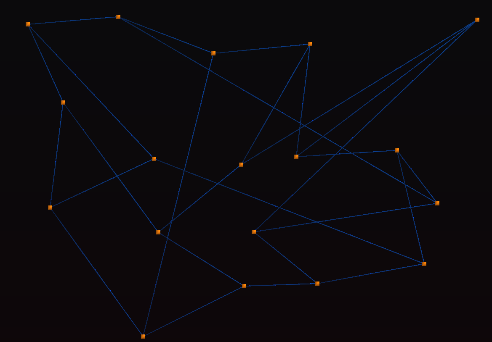
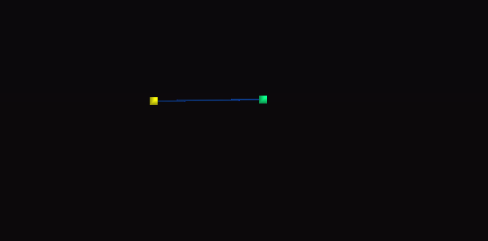
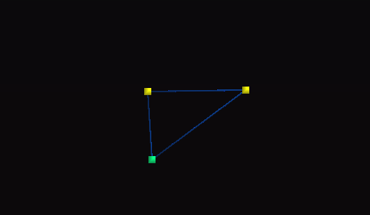
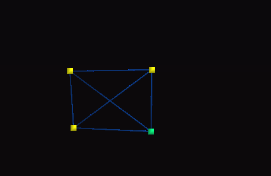
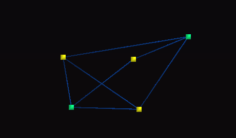
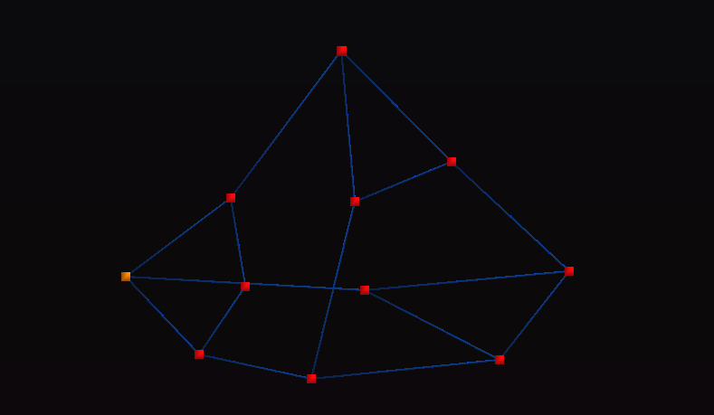
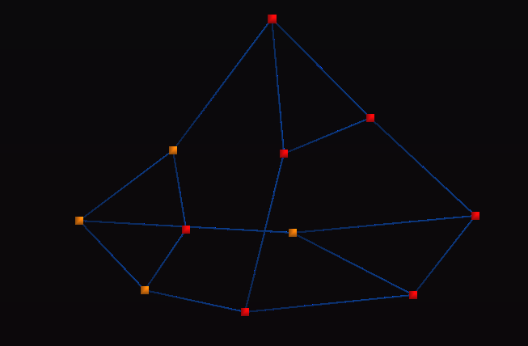
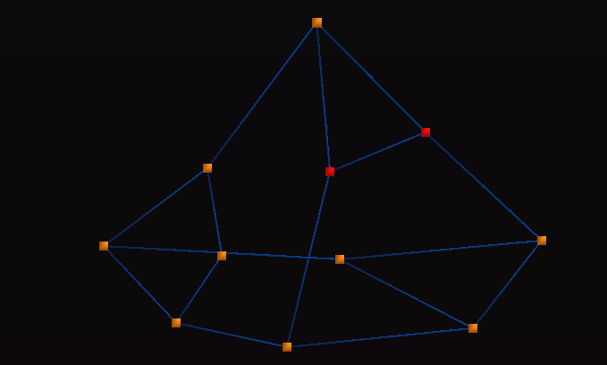
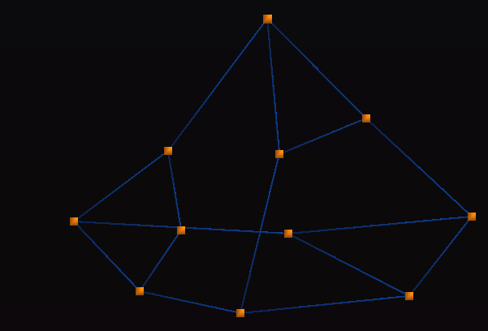

= Systema p2p

    un sistema estructurado de (n) conexiones
    ejemplo de red de (3) conexiones por nodo

==== tracker:

    se encarga solamente de dar una dirección IP de algún nodo conectado a la red;

==== nodo:

    se encarga de buscar una posición en la red;
    se encarga de conectar y desconectar con otros nodos;
    se puede integrar con sub-sistemas.

==== funcionamiento de la creación de red:

    debe haber un tracker activo.
    1. pide una dirección de algún nodo de la red.
    2. se conecta a la red y empieza a buscar los nodos con menor latencia.
    3. teniendo los nodos con menor latencia, establece una conexión estable.
    4. listo para enviar y recibir datos desde la conexión estable.

==== tipos de conexión en la red:

* conexión estable:

    la conexión estable es por la que pasan los sub-sistemas.

* conexiones volátiles:

    la conexión volátil es para medir la latencia o pedir direcciones,
    en cuanto le dan una respuesta se desconecta.

==== sub-sistema:

    los sub-sistemas trabajan desde la conexión estable, para enviar y recibir datos.
    puede usar cualquier tipo de algoritmo de nodos para cualquier tipo de aplicaciones.

== ejemplo de aplicación:

    agregando un sub-sistema de comunicación.
    un sistema puede tener 255 conexiones, pero solo usaremos 3

==== sub-sistema de comunicación:

    manda un mensaje a todos los nodos conectados;
    si llega un mensaje y no lo tiene, lo reenvía a sus demás nodos,
    si lo tiene, no lo envía.

ejemplo con colores:

